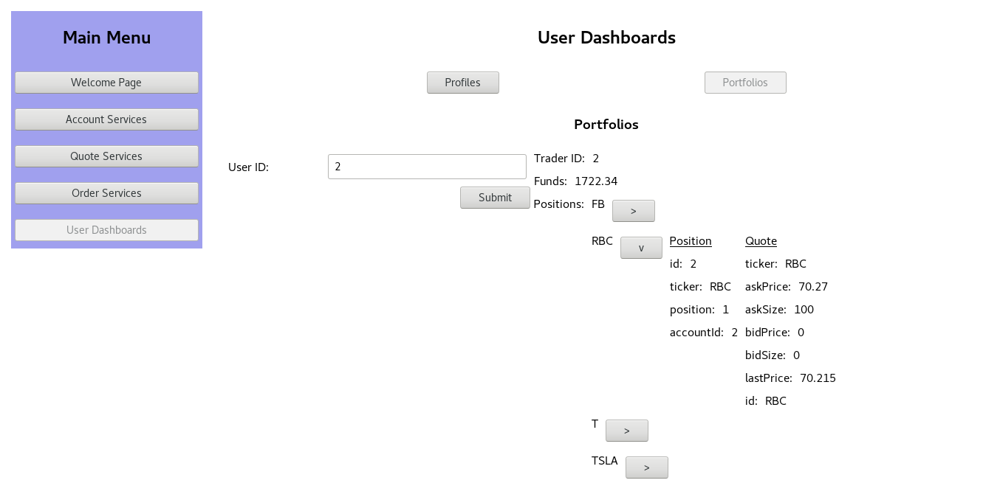

# Springboot Trading App UI with React

Table of Contents
* [Introduction](#introduction)
* [React](#react)
* [Quick Start](#quick-start)
* [Usage](#usage)
* [Improvements](#improvements)

## Introduction

The purpose of this app is to provide a web-based UI for interacting with the Springboot trading API
which was developed in a previous Jarvis project. This project serves as an introduction to modern Javascript 
(using the ES6 standard) using Node.js and React, as well as some rudimentary HTML and CSS. This app was created
using the [`create-react-app` project template.](https://github.com/facebook/create-react-app)

## React

React is a Javascript library built to create HTML application interfaces through the use of custom stateful components.
React features two major varieties of components: class components and functional components. 

Class components use syntax introduced in ES6 (ECMAScript 2015) to declare components as Classes, which behave similarly
to classes in other languages like Java. Class components must extend `React.Component` or `React.PureComponent`.
Class components give you direct access to features such as state, lifecycle functions, and DOM references. Class components
tend to be more complex than their functional counterparts, especially in the cases of sharing state and using the
keyword `this`.

Functional components consist of a single function which takes in some properties and produces some HTML. 
Functional components are typically simple and easily reusable, but cannot directly access certain features such as state
or DOM references. React version 16.8.0 introduced Hooks, which allow functional components to use some features previously
limited to class components. [You can read more about React Hooks here.](https://reactjs.org/docs/hooks-intro.html).

Unlike many other Node libraries, React is embedded in a standard webpage and runs in the client's browser, so certain
factors, such as browser compatibility and environment variables, need to be considered. Transpilers such as Babel can
help maximize compatibility while also "minifying" your code. Environment variables are read at build time and are 
injected directly into your code where they are referenced. To avoidaccidentally leaking important information,
React will only read environment variables starting with `REACT_APP_`.
Environment variables may be defined at the system level, or in [one of several `.env` files.](https://create-react-app.dev/docs/adding-custom-environment-variables/#what-other-env-files-can-be-used)

Finally, React introduces a special markup language called JSX, which acts as pseudo-HTML that can be written inline and
treated like any other Javascript object. Other components may be used in JSX by importing them and using them like an HTML tag.
JSX may also have Javascript code embedded in it, which can be used to reference variables, assign callbacks to events
(watch out for `this` issues), conditionally render DOM elements, or even run arbitrary code that outputs JSX 
(see [portfolio-form.js](./src/forms/portfolio-form.js) for an example of the latter).

## Quick Start

- Requirements:
  - `Node.js` version 8.10 or higher
  - `npm` version 6 or higher
  - [Springboot Stock Trading Web API](../springboot/).
  - Any modern web browser
- Development version
  - Edit the `.env` file in this project's root to point to the Springboot API.
  - Navigate to the project root and execute `npm start`, or the equivalent `yarn` command.
  - The server will be hosted on `localhost:3000`.
- Production version
  - Edit the `.env` file in this project's root to point to the Springboot API.
  - Navigate to the project root and execute `npm run-script build`, or the equivalent `yarn` command.
  - Copy the contents of the `build/` directory to a pre-configured web root, such as `/var/www/html/` for `httpd` servers.
  - App URL will depend on web server configuration and location within the web root.
  
## Usage

This app is designed to be used as an administrative console for interacting with the Springboot API project in this repository,
similar to that project's `swagger-ui`. The various endpoints are organized into groups based on the services they provide, 
and each group may be accessed using buttons on the left of the page. The following screenshot is a sample of the App in use.

The following functions are available within each group.

- Account Services
  - Create and delete trader accounts
  - Deposit and withdraw simulation money from traders' accounts
- Quote Services
  - Retrieve a quote from third party market data provider, IEX.
  - Retrieve internally-stored quotes.
  - Track new market symbols.
  - Update symbols using IEX data, or perform manual updates.
- Order Services
  - Place buy or sell orders for certain traders.
- User Dashboards
  - Access trader profiles and portfolios.
  
## Improvements
- Add a built-in web server to the project, such as `Express`, `Serve`, `Fastify`, `Next.js`, etc.
- Create a "user mode" web page that is overall more useful for the average user.
- Visual design/CSS improvements.
